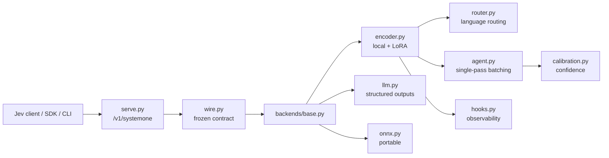

<p align="center">
  
</p>

# Tachyone

> **Local-first, multilingual System One decision engine that speaks the TypeSafe Jev `/v1/systemone` protocol.**
>
> **LLMs generate text. Tachyone produces calibrated decisions. Don't ask a model to decide — ask Tachyone.**

Tachyone answers atomic structured questions — `choice`, `score`, and `noul` — and returns typed
values with probabilities and calibrated confidence. Point an existing Jev client at a Tachyone
server and it works unchanged; run the local encoder backend for fully offline inference.

**Status: `v0.9.0` released.** All milestones M0–M6 are complete, plus the post-M6
**B-1 multilingual quality** work (localized data, per-`(primitive, language)` temperature, and a
multilingual LoRA raised to rank 64), **B-2 fast path** (per-shape CUDA graphs with bf16 weights),
**B-3 confidence thresholding / System-2 handoff**, and **B-4
input-noise robustness** — plus **B-7 public probes** (typed-decisions, MASSIVE and XNLI with
licences, chance levels and reproduction commands in `benchmarks/probes.md`), **B-8
calibration-asset hardening** (an unusable adapter asset warns by name instead of degrading
silently), **B-10's LLM prompt fix** (probe `JSON ok` 0.083 → 0.889 with parsing kept strict),
the **B-5a multi-domain data refactor** (five committed domains, `per_domain` reporting and
byte-identical output for every existing config — both gates pass when re-measured on the
corrected labels), and **B-11 + B-12**, which derive *every* label in all three primitives from
the text it accompanies (ADR-0014 + ADR-0015: all datasets regenerated, both adapters republished,
and the label audit published beside the accuracy), and **B-5 / ADR-0016**, which ships the
per-domain `choice`-head bank and its deterministic gate, the optional `choice_head` request hint,
the frozen-trunk bank fitter, and republished `tachyone-en` as the **five-domain** adapter
(`choice` 1.000 and every domain ≥ 0.963, with the support `noul`/`score` trade published beside
it rather than summarized). Then **B-13 + P3** (the English mixture retrain; evidence-based
confidence with its gate recorded NOT met), the **data-recipe corrections (Fases 0–2b)** —
sampler strides decoupled, leave-one-template-out evals (0.00% template overlap), content ×3,
volume 1.7× —, **B-14** (the recompose retrain, whose `noul`/`support`/`it` cell inversion was
root-caused to the trainer's sequential primitive phases and fixed by the interleaved
continuation, with a per-cell validation monitor added to the trainer), **B-15** — both
checkpoints retrained on `template_split: "train"`, the first **honest holdout number**
(multi **0.8355** / en **0.9825**), — and **B-17**: the teacher (`qwen3.6:35b`) expanded the
tone banks, the multilingual arm retrained, and **B-1's per-language ECE acceptance closed**
(holdout multi **0.9264**, **12/12 cells ≤ 0.05**, gap −11.1 → −1.7 points), with the
remaining NOT-met results disclosed rather than smoothed (see the model card). The wire
contract, an OpenAI-compatible LLM backend, a local encoder
(ModernBERT/mmBERT + LoRA), an ONNX backend, FastAPI serving, an SDK/CLI, MCP + LangChain
integrations, a training pipeline, and a docs site all ship. LoRA adapters are published on the
Hugging Face Hub. See the
[CHANGELOG](CHANGELOG.md) for releases, next steps in
[`.specs/project/BACKLOG.md`](.specs/project/BACKLOG.md), and
[`.specs/project/STATE.md`](.specs/project/STATE.md) for decisions and blockers.

---

## Why Tachyone

Hosted decision APIs are fast but remote, closed, and metered; autoregressive LLMs are
local-capable but slow and poorly calibrated for atomic judgments. Tachyone sits in between:

- **Drop-in** — same request/response as Jev; repoint the client and keep your code.
- **Local-first** — the base install runs offline with no API key; the HTTP server is one mode, not the only one (the CLI's default backend is `llm`, so pass `--backend encoder` or `--backend fake` for a key-free run).
- **Fast** — the local backend is non-autoregressive: one forward pass, no decoding loop; `TACHYONE_FAST=1` adds a CUDA-graph path (2.7× p50 on an RTX 3060).
- **Calibrated** — probabilities trained with strictly proper scoring (RLCD) plus per-`(primitive, language)` temperature fitting.
- **Multilingual** — mmBERT-based checkpoint covering 100+ languages via automatic script/language routing.
- **Additive** — router control, hooks, `predict_batch`, MCP, and LangChain extend the contract without breaking it.

## How it compares

Mirrors the canonical table in [`docs/overview.md`](docs/overview.md#how-tachyone-compares).

| | Jev | Laya | Needle | **Tachyone** |
| --- | --- | --- | --- | --- |
| Wire contract | `/v1/systemone` (hosted) | `/v1/systemone` (self-hosted) | Own tool/embedding API | **Jev-exact, self-hosted** |
| Hosted dependency | Required | None | None (device engine) | **None in core** |
| LLM backend | — | No (encoder only) | No | **Yes (optional)** |
| Encoder backend | Own model | Yes | Yes (2-bit) | **Yes (ModernBERT/mmBERT + LoRA)** |
| ONNX backend | No | Yes | Yes | **Yes (`onnx` extra)** |
| MCP / LangChain | No | Yes | No | **Yes** |
| Multilingual | Yes | Yes (mmBERT) | Partial | **Yes (100+ routed, 6 trained)** |
| Fast path | Proprietary | No | Quantized | **CUDA graphs (`fast` extra)** |
| Extension model | n/a | Router, hooks | Grammar, telemetry | **Router, hooks, batch (additive)** |
| License | Proprietary service | Apache-2.0 | Open | **Apache-2.0** |

## Install & quickstart

```bash
uv sync                 # core: offline, no key, no heavy deps
uv sync --extra serve   # + FastAPI server (+ integration/e2e test deps)

# Answer a question from the CLI (offline, model-free):
uv run tachyone --predict --preset triage --backend fake "refund please"

# The local encoder (downloads base weights + LoRA adapters, needs the train extra):
uv sync --extra train
uv run tachyone --predict --preset triage --backend encoder "Quero cancelar minha assinatura agora"

# Run the HTTP server:
uv run tachyone-serve
```

```python
# Python SDK
from tachyone import TachyoneClient
from tachyone.primitives import ScoreQuestion

client = TachyoneClient("http://127.0.0.1:8000")
result = client.system_one(
    "This product is amazing!",
    {"sentiment": ScoreQuestion(
        instructions="Rate the sentiment.",
        criteria=["very negative", "negative", "neutral", "positive", "very positive"],
    )},
)
print(result.answers["sentiment"].score)
```

```bash
# Drop-in: point an existing Jev client at tachyone
curl -s http://127.0.0.1:8000/v1/systemone \
  -H "Content-Type: application/json" \
  -d '{"state":"hello","model":"tachyone-latest","questions":{"q":{"type":"noul","instructions":"Is this a greeting?"}}}'
```

## Local encoder & published models

`TACHYONE_BACKEND=encoder` (local, offline once cached) loads `answerdotai/ModernBERT-large` or
`jhu-clsp/mmBERT-base` and applies the published LoRA adapter. Override with
`TACHYONE_ADAPTERS="tachyone-en=acme/tuned-en,tachyone-multi="`; force cache-only with `TACHYONE_OFFLINE=1`.
On a CUDA device, `TACHYONE_FAST=1` opts into the per-shape CUDA-graph forward (bf16 weights) with
graceful fallback.

- Adapters: [`munod/tachyone-en`](https://huggingface.co/munod/tachyone-en) ·
  [`munod/tachyone-multi`](https://huggingface.co/munod/tachyone-multi)
- Measured on NVIDIA L4 23GB through the routed runtime (both checkpoints pinned — full tables
  and reproduction commands: [`benchmarks/report.md`](benchmarks/report.md)):

  | Checkpoint | Split | Overall | ECE | p50 |
  | --- | --- | --- | --- | --- |
  | English (ModernBERT-large + five-domain LoRA r=16 + choice-head bank) | support | **1.0000** | 0.188 | 57.7 ms |
  | English, five-domain | 5 domains | **0.9983** | 0.191 | 57.7 ms |
  | English, **holdout phrasing** (never in training) | 5 domains | **0.9825** | 0.188 | 58.0 ms |
  | Multilingual (mmBERT-base + LoRA r=64 + fitted bank), routed | support | **0.9300** | 0.038 | 52.8 ms |
  | Multilingual, five-domain | 5 domains | **0.9221** | 0.026 | 53.5 ms |
  | Multilingual, **holdout phrasing** (never in training) | 5 domains | **0.9264** | 0.032 | 53.3 ms |

  The two **holdout** rows are the honest generalization number (v0.11.0, **B-17**): training
  and those evals share **0%** of templates — the gate rows are sha-pinned and never moved —
  so the score measures phrasing generalization instead of recognition: multilingual
  **0.8355 → 0.9264** (**+0.164 over the previously released adapters**), English 0.9825,
  with the in-template → holdout gap collapsed from −0.1105 to **−0.0165**. **B-1's
  per-language ECE acceptance (NFR-C06) is CLOSED**: all **12/12** `(primitive, language)`
  cells ≤ 0.05 on the holdout (worst `score/fr` 0.0257; `score/it` 0.1495 → **0.0014**).
  Still published **NOT met**, never smoothed: the English confidence fit's in-domain
  acceptance (`choice` T pegged at 10.0, in-domain `choice` ECE 0.5243, accuracy untouched)
  and, off-domain, **MASSIVE 0.074 → 0.058 with `ECE raw` 0.046 → 0.197** — in-domain gains
  re-sharpened off-domain confidence (the L-007/L-015 trade, still 3.4× chance); numbers in
  the [model card](docs/model-card.md) and `BACKLOG.md` **B-17**. The English ECE column
  is that pooled never-trained fit; the
  multilingual rows are the routed product (~13–15% of rows fall through to the English
  checkpoint by design — L-013 — and the multilingual checkpoint itself answers **0.9961** when
  it answers everything).

  Every label comes from the text it accompanies (B-11 + B-12 / ADR-0014 + ADR-0015): `noul` from
  its phrase bank, `score` from the tone's level, `choice` from the option the state names, with
  defaults for the empty boundary states — so the audit shipped beside these tables reports **0
  contradictory rows** (the pre-B-11 labels contradicted 121 of 241 request-toned English rows, and
  7.8% of `score` rows carried a "near-tie" the text never showed). The dedicated `choice` head
  (L-002) and localized per-record-RNG data (B-1) lifted multilingual `choice` from ~0.25 (chance);
  after the B-16 confidence map and the B-17 teacher expansion, **all 12 `(primitive, language)`
  cells sit at ECE ≤ 0.05 on unseen phrasing — B-1's NFR-C06 acceptance is CLOSED** (the
  support-only routed split, a different view, still shows three languages above the line,
  worst `nl` 0.091). The CUDA-graph
  fast path (`TACHYONE_FAST=1`) improves p50 by **2.5×** on English (17.31 → 6.83 ms) and
  **3.7×** on the multilingual five-domain path (14.23 → 3.84 ms) — re-measured on the v0.9.0
  artifacts (2026-10-08), with **0 top-label changes** on multilingual and **1 of 16 sampled**
  on English (disclosed as measured; NFR-P01 met by both paths). The external probes were
  re-measured after **B-17** (2026-10-10): XNLI **0.333** (exactly chance — the B-13
  mixture's MultiNLI layer is not in the recomposed recipe) and typed-decisions **0.306**
  are unchanged (English ran no training), MASSIVE reads **0.058** against its 0.017 chance
  with `ECE raw` **0.197** — the in-domain gains re-sharpened off-domain confidence (the
  L-007/L-015 trade; details in
  [`docs/benchmarks.md`](docs/benchmarks.md)). JevBench remains set aside by decision after
  its maintainer changed the submission methodology (Intelligence **8.4 → 15.0** belongs to
  the v0.8.0 artifact).

## Architecture at a glance



Full detail: [`docs/architecture.md`](docs/architecture.md) · Contract: [`docs/protocol.md`](docs/protocol.md).

## Quality gates

```bash
uv run ruff check .
uv run ruff format --check .
uv run pyright
uv run pytest                       # contract + unit + integration + e2e
uv run mkdocs build --strict        # docs site (uv sync --group docs)
```

## Roadmap

| Phase | Milestone | Status |
| --- | --- | --- |
| M0 | Bootstrap | ✅ |
| M1 | Wire Contract | ✅ |
| M2 | LLM Backend + Serve | ✅ |
| M3 | Local Encoder | ✅ |
| M4 | Training & Calibration | ✅ |
| M5 | Ecosystem & Acceleration | ✅ |
| M6 | Proof & Release | ✅ (`v0.1.0`) |
| B-1 | Multilingual quality + per-language temperature | ✅ (`v0.2.0`) |
| B-2 | Fast path (CUDA graphs) | ✅ (`v0.2.0`) |
| B-3 | Confidence thresholding / System-2 handoff | ✅ (`v0.3.0`) |
| B-4 | Input-noise robustness + clean/noisy split | ✅ (`v0.3.0`) |
| — | Multilingual LoRA rank 16 → 64 | ✅ (`v0.3.0`) |
| B-11 + B-12 | Labels derived from the text (ADR-0014/0015) | ✅ (`v0.5.0`) |
| B-5 / ADR-0016 | Per-domain `choice`-head bank + deterministic gate | ✅ (`v0.5.0`) |
| B-5b | Multilingual five-domain coverage | ✅ (`v0.6.0`) |
| B-13 + P3 | English mixture retrain + evidence-based confidence | ✅ (`v0.7.0` / `v0.8.0`) |
| Fases 0–2b + B-14 | Data-recipe corrections + recompose retrain (cell-inversion fix, per-cell monitor) | ✅ (`v0.9.0`) |
| B-15 | `template_split: "train"` retrain — honest holdout number | ✅ (`v0.9.0`) |

Details: [`docs/roadmap.md`](docs/roadmap.md) · Tasks: [`docs/tasks.md`](docs/tasks.md).

## Documentation map

| Doc | Contents |
| --- | --- |
| [`docs/overview.md`](docs/overview.md) | Vision, personas, use cases, success metrics, non-goals |
| [`docs/compare.md`](docs/compare.md) | **Why not a small LLM / Jev / another scorer?** — numbers and method |
| [`docs/use-cases.md`](docs/use-cases.md) | **Five recipes with tested JSON in/out** (classification, routing, priority, risk, triage) |
| [`docs/integrations.md`](docs/integrations.md) | **FastAPI · MCP · LangChain/LangGraph · n8n · Power Automate · Azure Functions · Docker** |
| [`docs/protocol.md`](docs/protocol.md) | The `/v1/systemone` contract |
| [`docs/architecture.md`](docs/architecture.md) | Components, flows, backend strategy, hooks |
| [`docs/cli.md`](docs/cli.md) | CLI flags, presets, modes, exit codes |
| [`docs/mcp.md`](docs/mcp.md) | MCP stdio server (`tachyone-mcp-server`) |
| [`docs/langchain.md`](docs/langchain.md) | LangChain/LangGraph `Runnable` adapter |
| [`docs/docker.md`](docs/docker.md) | Image, Compose, healthcheck, config in containers |
| [`docs/cookbook-handoff.md`](docs/cookbook-handoff.md) | Confidence thresholding + System-2 handoff |
| [`docs/benchmarks.md`](docs/benchmarks.md) | Accuracy/ECE/latency numbers and limitations |
| [`docs/jevbench.md`](docs/jevbench.md) | The external scoreboard: public-item diagnostic, pins, submission |
| [`docs/roadmap.md`](docs/roadmap.md) | Milestones, exit criteria, backlog |
| [`docs/tasks.md`](docs/tasks.md) | Atomic task plan (M0–M6) |
| [`docs/adr/`](docs/adr/) | Architecture decision records |
| [`docs/requirements/`](docs/requirements/) | Functional, non-functional, traceability |
| [`docs/testing.md`](docs/testing.md) | Contract/parity tests, gates, benchmarks |
| [`docs/training.md`](docs/training.md) | Data generation, LoRA/QLoRA, RLCD, calibration |
| [`docs/huggingface.md`](docs/huggingface.md) | Publishing and loading adapters |
| [`docs/release.md`](docs/release.md) | Release checklist |
| [`docs/model-card.md`](docs/model-card.md) | Hugging Face model card |
| [`benchmarks/report.md`](benchmarks/report.md) | Reproducible benchmark report |
| [`CHANGELOG.md`](CHANGELOG.md) | Notable changes (Keep a Changelog) |
| [`CONTRIBUTING.md`](CONTRIBUTING.md) | Conventions, gates, contract-test rule |

## Contributing

See [`CONTRIBUTING.md`](CONTRIBUTING.md). Short version: conventional commits, one logical
change per commit, English docs/PRs, and **any public API change must update the contract test
in the same commit**.

## License

[Apache-2.0](LICENSE).
