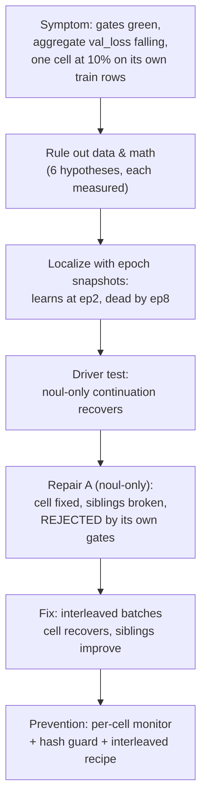

# Case study: the cell that inverted

**B-14 · 2026-10-07 · closed the same day, by measurement at every step.**

A multilingual arm passed every pre-registered gate and its aggregate validation loss kept
improving — while one validation cell, `noul`/`support`/`it`, scored **10% on its own training
rows**, i.e. confidently backwards. This page is the full debugging trail: what was ruled out
*with measurements*, how the flip was localized to a training phase, the test that named the
driver, the repair that failed by its own gates, the fix, and the monitor that now makes this
class of defect impossible to hide. The authoritative record lives in
[`BACKLOG.md` **B-14**](https://github.com/munod/tachyone/blob/main/.specs/project/BACKLOG.md)
(committed before any of this was written); every number below is quoted from it or from the
run logs.



## 1. The symptom: green gates, falling aggregate, one cell backwards

The B-14 cycle (data-recipe corrections + recompose retrain) shipped through its five
pre-registered gates: `support` 0.9413 ≥ 0.7887, worst domain ≥ 0.70, per-domain ECE within
budget, gate strict 1.000, every language ≥ baseline — recorded in commit `a90367a`. While
detailing the B-1 per-language numbers afterwards, one cell stood out:

- the joint trunk **and** the fitted bank scored their own **1,192** `support`/`it` training
  rows at **0.10 accuracy** (`P|1` 0.456 vs `P|0` 0.715 — backwards);
- `eval_multi` reported `noul`/`it` at **0.0723** while every other language sat at 1.000;
- yet `choice`/`score` stayed healthy and `it` in the other four domains was 1.000.

**Why no gate caught it:** the gates covered overall cells, per-domain accuracy and
per-*language* accuracy — never `noul` per language. The aggregate validation loss hid it the
same way: the cell was worth ~0.010 of the final **0.097**, so the curve improved while the
cell died (commit `90d6009`).

## 2. Ruling things out — six hypotheses, each with a measurement

| hypothesis | test | result |
| --- | --- | --- |
| broken labels (post-B-11 audit) | audit the train file rows | clean — neutral→0, request→1 (ADR-0014) |
| split membership | count rows | 1,192 in train, zero duplicate ids |
| question text differs between training and runtime | cosine of the same row, both paths | identical (−0.1958) |
| `noul` math / temperature sign | same cosine, positive T | sign-only — cannot flip |
| content age | compare pre-expansion vs expansion phrases | inversion uniform across both |
| fit/export path | joint trunk vs fitted bank | inverted identically |
| early-training artifact | epoch-1 cosines | healthy: `it` request **+0.9735**, neutral **+0.9431**, same as `de` |

Everything ruled out except one thing: **the flip happens between epoch 1 and epoch 8.**
A signature of the cell sat in plain sight: its empty-state baseline was 0.707 against
0.437–0.444 in the other 14 cells. And the released adapter plus the pre-B-14 trunk both
scored these rows **0.892 correct-direction** — this was a regression of the training run, not
of the data (commit `90d6009`).

## 3. Localization: the cell learns, then dies with its own gradient pointing out

Snapshotting the seed-42 run at epochs 1, 2 and 4 (`checkpoints/tmp_diag_epoch{1,2,4}`, kept)
gave the decisive table:

| snapshot | `support/it` `noul` | control `support/de` | aggregate `val_loss` |
| --- | ---: | ---: | ---: |
| epoch 1 | 0.500 (everything uniform) | 0.500 | 0.839 |
| **epoch 2** | **1.000** (`P\|1` 0.727 / `P\|0` 0.422) | 1.000 | 0.713 |
| **epoch 4** | **0.793, degrading** (0.584 / 0.494 — *its own gradient still points to recovery*) | 1.000 | 0.620 |
| epoch 8 (as shipped) | **0.100 inverted** (0.457 / 0.715) | 1.000 | **0.097** |

The cell was **correct at epoch 2** and died while its own gradient still pointed the right
way — the signature of catastrophic interference through the shared trunk, driven by the
other streams, not by anything in the cell's own data (commit `578704c`). Aggregate `val_loss`
improved throughout. "Stop early" was not a free fix: the epoch-4 model read `noul` 0.9884 on
the full eval but its joint `choice` was 0.3016 and its val_loss 0.620.

## 4. The driver test: naming the culprit

The trainer runs each epoch as **sequential phases** — all `noul`, then all `choice`, then all
`score`, `score` last — so each primitive gets ~490 consecutive pure steps through the shared
trunk. Hypothesis: those long pure phases are the driver. Test: continue from the healthy
epoch-4 checkpoint with **`noul`-only** epochs (same split, same shuffle seeds, same loss
math) — i.e. remove the choice/score streams entirely.

**Result (commit `1a95cc4`): `support/it` = 1.000** (`P|1` 0.731 / `P|0` 0.269), **zero**
cells below 0.95 — while the real run's choice/score stream drove the same cell to 0.100 over
the same epochs. The cell does not just survive without them; it fully recovers. The
choice/score gradients are the driver.

> **Trap that invalidated the first attempt:** `PeftModel.from_pretrained` defaults to
> `is_trainable=False`, so the first continuation trained only the fresh temperature parameter
> and saved input-identical weights. Caught by hashing `adapter_model.safetensors` before and
> after — **identical hashes mean nothing trained**. That rule is now built into
> `training/interleave_continue.py`, which fails loudly instead of shipping a no-op.

## 5. The repair that failed — by its own gates

Path (1): a `noul`-only repair from the final trunk, then re-fit and re-gate. It did what it
was designed to do — the cell went **0.100 → 1.000**, every language's `noul` to 1.000 — and
then the pre-registered gates rejected it:

| axis | before | after `noul`-only repair |
| --- | ---: | ---: |
| `choice` (same harness) | 1.000 | **0.9056** |
| `score` | 0.9956 | **0.9116** |
| overall | 0.9863 | **0.9391** |
| per-domain ECE | within budget | **0.063–0.102** (4 of 5 over the 0.05 gate) |

Single-primitive fine-tuning is zero-sum through the shared trunk. The gate system caught the
repair exactly as it was fixed to do — **a gate system is also judged by what it rejects**
(commit `bb9d0b3`, `benchmarks/results/multi_b14fix.json`).

## 6. The fix: batch order matters through a shared trunk

If long pure phases are the driver, the antidote is round-robin: `noul`, `choice`, `score`,
`noul`, … — same loss math, same split, same per-epoch shuffle seeds, *only the delivery order
changes*. Two continuation runs from the **original lineage**, two epochs each:

| axis | original e8 trunk | + 2 interleaved epochs |
| --- | ---: | ---: |
| train cell `noul`/`support`/`it` | 0.0977 | **0.9977** |
| `eval_multi` `noul`/`it` (the 0.0723 term) | 0.0723 | **0.9880** |
| `choice` (raw eval) | 0.9800 | 0.9968 |
| `score` (raw eval) | 0.9956 | 0.9996 |
| overall (raw eval) | 0.9796 | **0.9985** |

Both directions of the interference resolved in one run: the inverted cell recovered **and**
the healthy siblings improved. Log excerpts (epoch losses, volatile run logs quoted here):

```text
il_orig (from the original trunk):  epoch 8 interleaved train_loss noul=0.0144 choice=0.0260 score=0.0312
                                    epoch 9 interleaved train_loss noul=0.0081 choice=0.0241 score=0.0153
adapter sha256 9f646f3e… → b8e9c1b6…  (training provably moved)
```

Then fit + calibrate + harness against the pre-registered gates: **all five PASS** —
`support` 0.9993, worst domain 0.9987, per-domain ECE 0.0019–0.0202 (zero exceptions), strict
1.000, every language ≥ baseline; overall **0.9995 / ECE 0.0004** against the first fit's
0.9863 / 0.0080 (commit `38c6e97`).

## 7. Prevention: make the cell unhideable

1. **Per-cell validation monitor** (`f57343f`) — every epoch the trainer buckets validation by
   `(primitive, domain, language)`, appends `cell_monitor.jsonl` to the output directory and
   prints the worst cell of each primitive beside the train loss:

   ```text
   epoch 1/8 cell_monitor noul=agent_tools/pt@0.1101 choice=voice/pt@2.3836 score=documents/es@0.6482
   epoch 8/8 cell_monitor noul=ecommerce/it@0.0657 choice=ecommerce/pt@2.7508 score=agent_tools/nl@0.0269
   ```

   The B-15 retrain ran with it on: no recurrence — final `noul:*:it` cells at 0.047–0.067.

2. **The interleaved continuation is the recipe** (`e9d49e4`) —
   [`training/interleave_continue.py`](https://github.com/munod/tachyone/blob/main/training/interleave_continue.py)
   ships the exact experiment that closed the defect: resume an adapter
   (`is_trainable=True`), warm-start the heads from its own bank, resolve hyperparameters from
   CLI > `finetune_config.json` > PEFT config (**never from the directory name**), hash before
   and after, and fail loudly if nothing trained.

3. **Pre-registered gates** — fixed in commits `d8e94fc` / `85a2f05` *before* any training,
   which is what made section 5's rejection meaningful instead of negotiable.

## 8. Takeaways

- **Gate the worst cell, not the average.** The defect lived exactly in the axis no gate
  covered (`noul` per language) and under the aggregate that kept improving.
- **A gate system is also judged by what it rejects.** The `noul`-only repair was a real fix
  for the reported symptom and the gates still refused it — correctly.
- **Order is a hyperparameter through a shared trunk.** Sequential phases are a silent
  assumption; round-robin batches removed a catastrophic-interference failure mode without
  touching loss math, data, or capacity.
- **Hash what you trained.** One no-op continuation (PEFT's `is_trainable=False`) was caught
  only because a sha256 changed nothing — the guard is now part of the tool.
- **Measurement beats intuition at every step.** Six hypotheses, one test each; a snapshot
  table; a driver test with a control. Nothing in the conclusion was asserted without a
  number.

Adjacent lessons: **L-017** (stride aliasing and the eval drawn from the same sampler — how
this data cycle started), **L-018** (training parity is behavioral, never bitwise),
**L-019** (an eval id is not a row key) in
[`STATE.md`](https://github.com/munod/tachyone/blob/main/.specs/project/STATE.md).
Timeline of the fix: `90d6009` (record) → `578704c` (localize) → `1a95cc4` (driver) →
`bb9d0b3` (rejected repair) → `8a51745` (retarget) → `38c6e97` (close) → `f57343f` /
`e9d49e4` (prevention).
