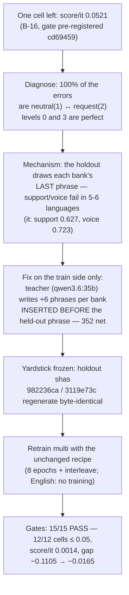

# Case study: the last cell

**B-17 · 2026-10-09/10 · the yardstick never moved.**

Two cycles had already done the heavy lifting — B-15 made the holdout honest (0% template
overlap, sha-pinned evals) and B-16 taught the multilingual arm to *report* confidence
correctly (serve-key detector v3 + a fitted 2D confidence map). Exactly one cell of B-1's
acceptance remained: **`score/it` at 0.0521**, against a ≤ 0.05 gate. This page is the trail
of how that last cell was closed: the failure reduced to **two held-out sentences per
domain**, a local teacher expanding the banks **around** the frozen gate, and a retrain that
fixed far more than the cell — without a single byte of the measurement moving.

## 1. One cell left

The B-16 cycle had taken B-1's failing set from **7 cells (worst 0.1495) to 1**: `score/it`
0.0521, everything else ≤ 0.0475. Two properties of that number framed the whole cycle:

- it was **accuracy-shaped**, not confidence-shaped: the cell's holdout accuracy was
  **0.8699** while its confidence map did all a map could do (an oracle scalar fitted *on the
  holdout itself* still floors at ~0.013 for `score` overall — the pooled basis was not the
  binding constraint, the model was);
- it was **phrasing-shaped**: in-template every cell read **1.0000**. Nothing was wrong on
  seen text — the model failed only on the words it had never seen.

Gates were pre-registered in `cd69459` **before any data edit**: T1 (12/12 cells ≤ 0.05),
T2 (the holdout files stay sha-pinned), T3 (B-16's gates re-verified, English byte-identical),
T4 (mechanism: `score/it` accuracy ≥ 0.93, reported whatever), T5 (Fase-0 data gates), T6
(detection ≥ 0.99), T7 (contract green).

## 2. The diagnosis: two sentences per domain

Decomposing the holdout errors for `score` left no ambiguity:

| matrix (Italian, support+voice) | predicted 0 | 1 | 2 | 3 |
| --- | ---: | ---: | ---: | ---: |
| **target 0** | 32 | — | — | — |
| **target 1** | — | 32 | **31** | — |
| **target 2** | — | **23** | 14 | — |
| **target 3** | — | — | — | 34 |

**All 54 errors are the neutral(1) ↔ request(2) confusion** — and
`_LEVEL_BY_TONE = {calm: 0, neutral: 1, request: 2, urgent: 3}` says exactly why: the
holdout eval draws **the last phrase of every bank**, so on unseen phrasing the two *middle*
tone banks read one level off while the extremes stay perfect. The offending sentences are
literally in the data:

- `support`/`it` neutral (held out): *"Controllo se qualcosa è cambiato con il `{entity}`."*
- `support`/`it` request (held out): *"Ho bisogno di aiuto con il `{entity}`."*

By domain the failure is concentrated and **not** Italian-only — holdout `score` accuracy:

| lang | support | voice | agent_tools | documents | ecommerce |
| --- | ---: | ---: | ---: | ---: | ---: |
| de | 0.867 | 0.711 | 1.000 | 1.000 | 1.000 |
| es | 0.726 | 0.726 | 0.857 | 1.000 | 1.000 |
| fr | 0.819 | 0.843 | 1.000 | 1.000 | 1.000 |
| it | **0.627** | 0.723 | 1.000 | 1.000 | 1.000 |
| nl | 0.735 | 0.867 | 1.000 | 1.000 | 1.000 |
| pt | 1.000 | 0.798 | 0.881 | 1.000 | 1.000 |

Two domains, two banks, six languages: the *concept* of a routine check versus a routine
request was memorized as *eight or ten specific sentences*, and the eleventh defeated it.

## 3. The fix: teach the concept, not the phrase

`training/expand_banks.py` (committed with the cycle) drives a local teacher —
**`qwen3.6:35b`** through Ollama, an owner-decided stand-in for the recorded "Qwen3.5:35b"
that isn't on the box — few-shot from each bank's own sentences:

- **scope**: `neutral` + `request` × 5 domains × 6 non-English languages, +6 phrases per
  bank → 360 accepted, **352 net** after hygiene;
- **insertion discipline**: new phrases go **before** the held-out last phrase — the gate's
  sentences are untouchable by construction, not by review;
- **validation at generation time**: exactly one `{entity}` placeholder, length and final
  period, normalized-duplicate-free across *every bank of that language in every domain*, and
  **no affirmative urgency outside the `urgent` bank** (the post-filter caught 8 phrases like
  *"Processo urgente referente ao `{entity}`"* — the urgent vocabulary belongs to level 3;
  the rule now rejects at generation time);
- **the teacher quirk**: qwen3.6 is a thinking model — with the default settings it burned
  the whole token budget inside `thinking` and returned an *empty* content
  (`done_reason: "length"`). The smoke test caught it before the real run; the fix is
  `think: false` plus headroom;
- **provenance**: every prompt, raw reply, acceptance and rejection landed in
  `training/data/b17_teacher_log.jsonl`; the removed phrases in
  `training/data/b17_urgency_rejected.json`.

The configs were retargeted to `checkpoints/multi_b17*` **before** the run (L-011: the
config documents the artifact it produces), and because the phrase set changed, the `en_pt`
and `noisy` goldens were recaptured in the same commit that explains why.

## 4. The frozen yardstick

The whole cycle is only meaningful because **the measurement could not drift** (T2):

- every bank regeneration left the held-out last phrase intact (asserted across all 60 banks);
- `data/eval_multi_domains_holdout.jsonl` regenerated to sha **`982236ca2728705f…`** and
  `data/eval_en_domains_holdout.jsonl` to **`3119e73c…`** — byte-identical, verified by hash;
- English data and evals regenerated byte-identical too, so the English checkpoint ran
  **no training** and became the cycle's control group.

A fix that could touch its own exam would prove nothing. This one couldn't.

## 5. The gates: 15/15

Read through the pre-registered protocol (checkpoint-alone `predict` reports — the protocol
B-15's numbers were recorded under, per **L-020**):

| Gate | Result |
| --- | --- |
| **T1 · 12/12 cells ≤ 0.05** | **PASS** — worst `score/fr` 0.0257; `score/it` **0.0014** |
| T2 · holdout sha pins | **PASS** — `982236ca` / `3119e73c` unchanged |
| T3 · B-16 gates re-verified | **PASS** — choice 0.9808, English byte-identical, tripwire 0.9735, strict 1.0000, languages ≥ 0.9928, support 0.9993, zero ECE exceptions |
| T4 · mechanism (reported) | `score/it` accuracy **0.9928** (target ≥ 0.93, from 0.8699) |
| T5 · data gates | **PASS** — volumes unchanged, goldens recaptured, config↔dataset green |
| T6 · detection key | **PASS** — 0.9988 / 0.9995 |
| T7 · contract | **PASS** — 739 tests, ruff/pyright/`mkdocs --strict` clean |

The complete cell table (holdout, n = 415–420): `choice` de 0.0225 · es 0.0000 · fr 0.0055 ·
it 0.0007 · nl 0.0049 · pt 0.0035 — `score` de 0.0007 · es 0.0165 · **fr 0.0257 (worst)** ·
**it 0.0014** · nl 0.0025 · pt 0.0056.

## 6. Beyond the target

The retrain did not stop at the gated cell:

| Axis | before (B-16) | after (B-17) |
| --- | ---: | ---: |
| holdout overall, checkpoint-alone | 0.8892 | **0.9828** |
| generalization gap (in-template → holdout) | −0.1105 | **−0.0165** |
| holdout overall, routed pair (ECE) | 0.8355 (0.0747) | **0.9264 (0.0318)** |
| `choice` holdout | 0.9248 | **0.9808** |
| `noul` tripwire, worst language | 0.7807 | **0.9735** |
| current split, every language | 0.9799–0.9960 | **0.9928–1.0000** (`es` 1.0000) |
| in-template multilingual ECE | 0.0228 | **0.0036** |
| English (control — no training) | — | **byte-identical** |

The same two sentences that failed in Italian now fail nowhere: `support`/`voice` rose from
0.63/0.72 territory to ~0.99 across languages, which is what "learned the concept" looks like
in numbers.

## 7. Disclosures (measured, never re-fixed)

- **Off-domain confidence paid a price**: MASSIVE reads **0.074 → 0.058** with `ECE raw`
  **0.046 → 0.197** — in-domain gains re-sharpened off-domain confidence, the L-007/L-015
  trade this project has published in the same direction every time. Still 3.4× its 0.017
  chance; typed-decisions and XNLI are unchanged (English rows never retrained).
- **The expansion targeted a diagnosed mechanism** — the per-domain table above is why the
  scope was what it was; disclosed with the cycle, never smoothed.
- **English's P3 in-domain `choice` ECE 0.5243** (pooled fit at T = 10.0) stands untouched
  — its follow-up (the fit-basis redesign) remains queued.

## 8. Takeaways

- **A frozen yardstick makes a fix falsifiable.** Insertion *before* the held-out phrase
  turned "don't leak the eval" from a review habit into a structural property, and the sha
  pins proved it (T2) independently of anyone's intent.
- **Reduce the failure before fixing it.** The gate failed on one cell; the *error matrix*
  reduced it to two sentences per domain — the fix wrote 352 phrases exactly there instead
  of retraining harder on everything.
- **Accuracy-shaped failures need the train side.** B-16 proved the calibration layer was
  exhausted (oracle floor above the gate); no amount of confidence mapping manufactures
  generalization the model doesn't have.
- **One factor per cycle, gates before data.** The recipe was byte-unchanged (8 epochs +
  interleave); only the phrases moved — and every number above was judged against thresholds
  written *before* the first edit (`cd69459`).
- **The control group is cheap when you keep one.** English ran no training and came back
  byte-identical (T3), which separates "the retrain improved things" from "the harness
  drifted".

Full record: [`.specs/project/BACKLOG.md` **B-17**](https://github.com/munod/tachyone/blob/main/.specs/project/BACKLOG.md)
· gates pre-registered `cd69459` · data `7ac4d91` · configs `9353a6a` · records `02c255d` ·
release `a71a6f0` (`v0.11.0`). Previous chapters: [the cell that inverted](case-b14.md)
(B-14) and the B-15/B-16 entries in the [roadmap](roadmap.md).
