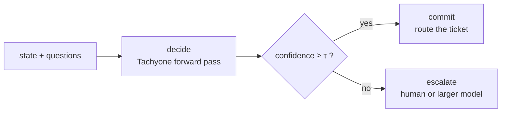

# LangGraph

A LangGraph node that makes a typed decision, plus a **conditional edge on `confidence`** — the
System-2 handoff drawn as a graph instead of written as an `if`.



- Extra: `langchain` (`uv sync --extra langchain` → `langchain-core` + `langgraph`)
- Uses: [`create_runnable()`](../langchain.md) for the decision, `assess_response()` from
  `tachyone.handoff` for the branch
- Status: **shipped + tested** — the script below is executed by
  `tests/test_docs_examples.py::test_langgraph_example_runs`

## The whole flow

Embedded verbatim from `docs/assets/examples/langgraph_flow.py`, so the code you read is the
code that runs in CI:

```python
--8<-- "assets/examples/langgraph_flow.py"
```

## Run it

```bash
uv sync --extra langchain
TACHYONE_BACKEND=encoder uv run python docs/assets/examples/langgraph_flow.py
```

Both branches are real, and the backend decides which one you get:

| Backend | Output | Why |
| --- | --- | --- |
| `encoder` | `committed -> billing-queue` | The engine is confident, the ticket is routed automatically |
| `fake` | `handoff -> human-review` | Flat distribution → `confidence` below τ → escalate |

That second row is the point of the graph: the *same* code escalates when the model is unsure,
instead of committing to a coin flip. `TACHYONE_TAU` overrides τ (default `0.6`, illustrative —
see [Choosing τ](../cookbook-handoff.md#choosing)).

## Wiring it into your own graph

```python
from tachyone.backends import build_backend
from tachyone.config import Config
from tachyone.handoff import assess_response
from tachyone.integrations.langchain import create_runnable
from tachyone.wire import SystemOneResponse

runnable = create_runnable(build_backend(Config.from_env()), model="tachyone-latest")

response = runnable.invoke({"state": ticket, "questions": questions})
report = assess_response(SystemOneResponse.model_validate(response), threshold=0.6)
if report.abstain:
    # System-2: a human queue, a frontier model, or a longer pipeline
    ...
```

Notes:

- The runnable returns the **canonical** `/v1/systemone` payload — no LangChain-shaped envelope —
  so `SystemOneResponse.model_validate()` gives you the same typed object the SDK sees.
- `create_runnable()` runs `asyncio.run(...)` internally: build it outside a running event loop
  (a normal sync LangGraph node is fine).
- `assess_response()` is client-side and additive: field names, nesting and error statuses are
  untouched (ADR-0001, ADR-0009).
- Invalid questions raise the contract `422` — let it propagate so the graph records the failure.

## Related

- [LangChain adapter](../langchain.md) — `predict()` and `create_runnable()` in detail.
- [Cookbook: abstain and hand off](../cookbook-handoff.md) — τ, entropy, margin, and composing
  with an LLM.
- [Integrations](../integrations.md) — every other entry point.
