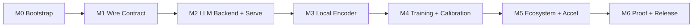

# Roadmap

> Canonical machine-facing roadmap lives in `.specs/project/ROADMAP.md`. This page is the
> human-facing view with exit criteria and risk notes. Task-level detail: `docs/tasks.md`.

**Current phase:** M6 Proof & Release ✅ complete and released (`v0.3.0`), including the post-M6
B-1 (multilingual quality + per-language calibration), B-2 (CUDA-graph fast path), B-3
(confidence thresholding / System-2 handoff) and B-4 (input-noise robustness) work.
**Delivery model:** one shippable increment per milestone; no fixed dates.

## M0 — Bootstrap

**Goal:** Reproducible Python 3.12 + uv project with quality gates and license.
**Depends on:** nothing.
**Exit criteria:**
- `uv sync` installs from `uv.lock` on Python 3.12.
- `uv run ruff check .`, `uv run pyright`, `uv run pytest` all pass.
- CI runs the same gates on push and PR.
- Apache-2.0 `LICENSE`, `README.md`, `CONTRIBUTING.md`, `AGENTS.md` present.

**Risks:** Python version drift (see B-001); uv lockfile churn.

## M1 — Wire Contract

**Goal:** Freeze the Jev-exact contract and primitives before backends.
**Depends on:** M0.
**Exit criteria:**
- Primitives validated with limits (choice ≤255, score 2–10 levels).
- `wire.py` matches Jev field names/types; golden fixtures pass.
- All documented error shapes (401/422/429/529) reproduce.
- A `FakeBackend` answers the full cycle offline.

**Risks:** misreading Jev edge behavior; mitigated by golden fixtures and `docs/protocol.md`.

## M2 — LLM Backend + Serving

**Goal:** End-to-end product using structured outputs of existing LLMs.
**Depends on:** M1.
**Exit criteria:**
- `POST /v1/systemone` served by FastAPI; SDK + CLI work.
- A real Jev client repointed at `tachyone-serve` returns correct answers.
- Backend is swappable behind `backends/base.py`; no wire change.
- Retry/backoff verified for 429/529.

**Risks:** structured-output reliability across providers (OD-1); provider drift.

## M3 — Local Encoder Backend

**Goal:** Offline single-pass encoder with routing and calibrated confidence.
**Depends on:** M2 (server reused), M4 (for a trained checkpoint — can start with base weights).
**Exit criteria:**
- All three primitives answered offline, no key, no network.
- Router selects English vs multilingual checkpoint with documented overhead.
- Confidence derived from distribution; `return_details` exposes probabilities.
- Batching (`predict_batch`, `sort_by_length`) and lifecycle (`preload`, `max_loaded`, eviction) work.

**Risks:** base-model quality before tuning; VRAM pressure with two checkpoints.

## M4 — Training & Calibration

**Goal:** Reproducible training and calibration within 12GB VRAM.
**Depends on:** M3 (architecture), M1 (data contract).
**Exit criteria:**
- `generate_data.py` → deterministic JSONL.
- LoRA/QLoRA fine-tuning completes on RTX 3060 12GB.
- RLCD proper-scoring training produces calibrated probabilities.
- Temperature fitting reduces ECE on a held-out split.
- Accuracy/ECE/latency report reproducible from committed scripts.

**Risks:** OOM (B-002); small calibration sets; synthetic-data bias.

## M5 — Ecosystem & Acceleration

**Goal:** Integration surface and speed paths, contract unchanged.
**Depends on:** M3, M4.
**Exit criteria:**
- ONNX backend + optional fast path (TileLang/CUDA graphs) behind extras.
- MCP stdio server, LangChain adapter, Docker/compose all work.
- Extras isolate optional dependencies; graceful fallback when unavailable.

**Risks:** ONNX op coverage; CUDA-graph constraints (OD-4).

## M6 — Proof & Release

**Goal:** Public credibility.
**Depends on:** M5.
**Exit criteria:**
- Benchmark report comparable to MASSIVE / XNLI / typed-decisions — **met (2026-09-27)**: the
  three named probes are measured on public data through the same metric code and published with
  licences, citations, chance levels and reproduction commands in
  [`benchmarks/probes.md`](https://github.com/munod/tachyone/blob/main/benchmarks/probes.md)
  (0.323 typed-decisions · 0.033 MASSIVE · 0.334 XNLI), alongside the head-to-head in
  [`compare.md`](compare.md) §3, which reproduces the peer model's own card to three decimals.
- Docs site published.
- Hugging Face weights + model card and a GitHub release.

**Risks:** benchmark comparability; weights distribution model (OD-3).

## Milestone → feature mapping

| Milestone | Feature spec |
| --- | --- |
| M0, M1 | `.specs/features/wire-contract/` |
| M2 | `.specs/features/llm-backend/` |
| M3 | `.specs/features/encoder-backend/` |
| M4 | `.specs/features/training-calibration/` |
| M5, M6 | `.specs/features/ecosystem/` |

## Post-M6 — Backlog (delivered)

The active backlog items shipped across `v0.2.0` and `v0.3.0` (figures are the ones measured at
the time — **B-11** later restated every dataset-level number, see below):

- **B-1 Multilingual `choice`/`score` quality** ✅ (`v0.2.0`) — localized per-language data,
  per-record RNG, per-`(primitive, language)` temperature fitting, runtime language detection, and
  per-language ECE reporting. Follow-up raised the multilingual LoRA rank to 64: overall accuracy
  0.702 → 0.853 and `es` ECE 0.170 → 0.038 (pre-B-11 labels; 2/6 languages ≤ 0.05 — `es`, `pt`).
- **B-2 Fast-path (TileLang/CUDA graphs)** ✅ (`v0.2.0`) — `TACHYONE_FAST=1` wires per-shape CUDA graphs
  with bf16 weights and graceful fallback; measured 2.68× p50 at the time, **2.72× re-measured on
  the B-11 adapters** (NFR-P01/P07 met).
- **B-3 Confidence thresholding / System-2 handoff** ✅ (`v0.3.0`) — `normalized_entropy`/`margin`
  and `assess`/`assess_response`; CLI `--threshold` appends a sibling `handoff` object (`CAL-06`).
- **B-4 Input-noise robustness** ✅ (`v0.3.0`) — seeded `noise_rate` augmentation and a clean/noisy
  evaluation split; the released adapters are already robust to the injected noise (`TRAIN-08`).

Shipped in `v0.4.0`:

- **B-7 Public probes** ✅ — `benchmarks/probes.py` loaders + `benchmarks/probes.md`:
  typed-decisions, MASSIVE and XNLI against their own chance levels, with licences, citations and
  reproduction commands; `OPS-06` implemented. **Re-run on the B-11 adapters (2026-09-28):**
  0.323 → 0.330, 0.033 → **0.013** (below MASSIVE's 0.017 chance), 0.334 → 0.333.
- **B-8 Calibration-asset hardening** ✅ — an adapter asset that cannot be loaded warns by name
  instead of degrading silently (`docs/huggingface.md` §4).
- **B-10 LLM prompt wrapper** ✅ — the `answers` wrapper documented for all three primitives;
  probe `JSON ok` 0.083 → 0.889 with parsing kept strict.
- **B-5a Multi-domain data** ✅ — the generator is split per domain with byte-identical output for
  existing configs, reports `per_domain`, and ships four new English domains plus presets. Six
  runs; run 5 is the artifact. On the pre-B-11 labels it met 1 of 2 gates (support 0.785 ✗,
  worst new domain 0.739 ✓) and released nothing; **re-measured on the B-11 labels both gates
  pass** (support 0.861 ✓, voice 0.807 ✓) — `.specs/project/BACKLOG.md` **B-5**.

Delivered 2026-09-28 (CHANGELOG `[Unreleased]`):

- **B-11 `noul` labels from the text** ✅ (ADR-0014) — the label rule, the acceptance tests, the
  label audit published beside the accuracy, seven datasets regenerated, both adapters retrained
  and republished (Hub `224c8a74` / `b7747756`): English 0.859 → **0.945**, multilingual restated
  at **0.718** (the old 0.853 was a language→label shortcut). Head-to-head, probes, fast path and
  the B-5a artifact were all re-measured in the same pass.
- **B-12 `score`/`choice` labels from the text** ✅ (ADR-0015, 2026-09-29) — the `index % 13`
  near-tie (7.8% of `score` rows, ceiling 0.888) and the index-derived labels of the empty
  boundary states are gone; `score` empty → middle level, `choice` empty → the catch-all
  (`ecommerce` gained `other` as a fifth option). Seven datasets regenerated, all three
  checkpoints retrained, and the **published set re-chosen by merit**: English **0.972** (B-11
  weights), multilingual **0.743** (B-12 retrain), five-domain run 5 **0.879** with **both gates
  passing** (0.886 / 0.815) — the retrain-on-corrected-labels option was tried and lost
  (`choice` 0.303, support 0.763), so B-5's structural decision is what remains. Fast path
  2.65×, probes 0.330 / 0.011 / 0.333, head-to-head 0.236 / 0.974 re-measured in the same pass.

Delivered 2026-10-01 (CHANGELOG `[0.5.0]`):

- **B-5 / ADR-0016: per-domain `choice` heads, published** ✅ — the keyed `choice_head.json` bank
  with its deterministic gate, the additive `choice_head` request hint, the bank trainer, the
  frozen-trunk fitter and the gate/oracle report row all shipped, and the four-arm isolate closed
  **91% of the support gap** (0.886 → **0.964** against the released 0.972; worst new domain
  0.963; gate strict **1.000**; per-domain ECE 0.021–0.027, all five under target). The
  **five-domain artifact was released as `munod/tachyone-en`** — support goes 0.972 → 0.964
  (`choice` 0.946 → **1.000**, `noul`/`score` −0.046/−0.032, both published) while the five-domain
  split goes 0.511 → **0.964**. The isolate's own answer: the shared-head control trails the bank
  by **3 of 2,500 `choice` rows**, so the labels closed the gap, not the per-domain capacity
  (lesson L-012).

Delivered 2026-10-02 (CHANGELOG `[Unreleased]`):

- **B-5b: multilingual five domains, published** ✅ — the four new lexicons localized to all
  seven training languages (read-aloud reviews + a 14,082-combination agreement audit), 30k/7.5k
  datasets whose support halves are byte-identical to the incumbent, the joint mmBERT run and
  the frozen-trunk head fit. **`munod/tachyone-multi` (`9a3ef5a5`)** goes **0.561 → 0.9975** on
  the five-domain split (worst new domain 0.438 → 0.993, gate strict **1.000**, per-domain ECE
  0.0005–0.0038 with zero exceptions, all six languages ≤ 0.004, held-out text 0.996) and
  **0.743 → 0.895** on the support-only routed split, with gates fixed from the baseline
  *before* training. Two lessons recorded: **L-013** — the routed harness had been answering
  13–15% of multilingual rows with the *English* checkpoint (which is why the published 0.743
  stopped reproducing), so a checkpoint's quality is never gated on a routed harness — and the
  **joint-bank deficit**: per-domain heads lost 5.6 points under joint training while the
  frozen-trunk fit ties bank vs shared at **1 row** (L-012 replicated), so the fitted bank is
  what shipped.

- **B-13: JevBench preparation — the English mixture retrain, published** ✅ — the public
  scoreboard for Jev-class decision models (its `typesafe` adapter speaks our frozen wire
  unchanged: 231/231 strict-valid on the first run). P0 measured the baseline (Intelligence
  **8.4**, Calibration **0**, composite **0.43** on the 231 public items); P1 re-audited the wire
  and **reverted** a 4096-token context that bought **net 0 accuracy** for −7.2 Speed
  (lesson **L-014**); P2 built three data layers — sha256-pinned MultiNLI/BoolQ/Banking77
  (11k), five executable-rule-tree families (3.5k, every target re-executes from its shipped
  facts+tree), a validated 35,540-record mixture — and trained **two arms one factor apart**
  on two L4s. Result: both B-5 gates pass with zero ECE exceptions, support and five-domain
  splits **0.964 → 1.000**, and on the public items Intelligence **8.4 → 15.0** against the
  fresh control's **+0.6** (the gain is the data's); XNLI **0.341 → 0.566**, typed-decisions
  **0.269 → 0.367**. The cycle's own target (I ≥ 50) was **not** met — `noul` still never reads
  the rubric — and lesson **L-015** records why Calibration reads 0 for every arm as shipped.

- **B-13/P3: confidence from evidence — adopted, its gate recorded NOT met** ⚠️ — the fix
  L-015 asked for. The English adapter now ships `state_prototypes.json` (K=32 centroids of
  its own 21,000 training states) and `confidence_calibration.json`: a `noul` answer keeps
  its direction and takes its magnitude from `max_k cos(state, centroid)`, `choice` runs at
  T=1.5 and `score` is pinned (its answer *is* the expected value, so a temperature would
  move Intelligence). Measured: accuracy **byte-identical** everywhere, in-domain ECE
  0.000-in-sample → **0.006 / 0.009** honest, off-domain raw ECE XNLI **0.426 → 0.264**,
  typed-decisions **0.578 → 0.416**, MASSIVE **0.583 → 0.296**, JevBench Calibration
  **0.0 → 52.6** and composite **1.59 → 4.28** with Intelligence invariant at 15.0. The
  recorded gate (**≥ 60**) was **not** met: no legal fit set can see bench difficulty (0.84
  vs 0.36 at the same evidence), and the design's estimate turned out to be an artifact of
  inverting a saturated transform (lesson **L-016**). ~~Open: **P4**, the `[bench request]`
  issue itself.~~ **Superseded 2026-10-08:** the JevBench maintainer changed the submission
  methodology upstream and the owner set the benchmark aside to continue development
  (`.specs/project/STATE.md` *Current Work*); the submission record stays in
  `docs/jevbench.md` as a measurement of the v0.8.0 artifact.

- **Data-recipe corrections + B-14 recompose retrain — published** ✅ (`v0.9.0`) — the
  sampler's option/hard-negative strides were aliased with the language stride (some
  six-language cells never saw particular labels at all; every distractor row landed in `pt`),
  the evals shared ~99% of their templates with training, content was thin and volume low:
  Fases 0–2b fixed all four (0 incomplete cells, **0.00%** template overlap, content ×3,
  volume 1.7× — 36,000 en / 52,200 multi). Both arms retrained on the recomposed data; the
  run's `noul`/`support`/`it` inversion was root-caused to the trainer's **sequential
  primitive phases** and repaired by the interleaved continuation
  (`training/interleave_continue.py`), with a **per-cell validation monitor** added to the
  trainer so one cell can never hide behind the aggregate again — full evidence trail in the
  [B-14 case study](case-b14.md).

- **B-15: `template_split: "train"` retrain — the honest holdout number** ✅ (`v0.9.0`) —
  both checkpoints retrained excluding the holdout template pool, so the holdout evals (0%
  template overlap) finally measure phrasing generalization: multilingual **0.8355**, English
  **0.9825** — **+0.127 / +0.131** over the released adapters. All pre-registered gates pass
  on the unchanged current benchmark (multi 0.9885 / ECE 0.0069 with zero exceptions when its
  checkpoint answers everything; en 0.9983). Recorded **NOT met**, never re-fixed: P3's
  in-domain ≤ 0.05 for the rebuilt confidence asset (pooled fit pegged `choice` at grid max
  T=10 → in-domain ECE 0.5243, accuracy untouched) and B-1's per-language holdout ECE for
  multilingual (worst `score/it` 0.1495). Both disclosed on the model card; follow-ups in
  `BACKLOG.md` **B-15**.

- **B-16: serve-key detector + 2D confidence map — B-1's calibration axis** ✅ (2026-10-09,
  no retrain). The calibration key now reads the state **and** the localized question with
  overlap-penalized stopwords and train-learned vocabulary (diagonal 65.8% → **99.80/99.95%**;
  checkpoint routing untouched), and multilingual `choice`/`score` answers report a fitted
  `peakedness × strength` confidence per `(primitive, language)` (14-cell asset with the
  prototype bank embedded). Holdout per-language ECE cells: **7 failing → 1** — `score/it`
  **0.0521** recorded NOT met (from 0.1495), everything else ≤ 0.05, and accuracy
  byte-identical everywhere. Disclosed: in-template ECE 0.0069 → 0.0228 (pooled-basis trade,
  zero gate exceptions) and the routed-pair reading (9/12 — quantifies the queued
  routing-quality item, 13% of choice/score rows). Part 2 — the data/generalization cycle for
  `score/it` and the −0.1105 holdout gap — queued by decision. Record in `BACKLOG.md`
  **B-16** (gates pre-registered `0f1593d`; lesson **L-020** on gate protocols).

- **B-17: teacher bank expansion — B-1 closes** ✅ (`v0.11.0`, 2026-10-10). Part 2 of the
  cycle: a local `qwen3.6:35b` teacher authored **352 net phrases** into every
  `neutral`/`request` bank (5 domains × 6 languages, inserted before the held-out phrase —
  the holdout evals stayed byte-identical, sha-pinned), the multilingual arm retrained with
  the unchanged recipe, English untouched. **All 15 gates PASS (15/15): every one of the 12
  `(primitive, language)` cells now reads ECE ≤ 0.05 on unseen phrasing — B-1's NFR-C06
  acceptance is CLOSED** (`score/it` 0.1495 → 0.0521 → **0.0014**; worst cell now `score/fr`
  0.0257). The expansion generalized far beyond the target: holdout overall **0.8892 →
  0.9828** (gap −0.1105 → **−0.0165**), `choice` 0.9248 → 0.9808, tripwire 0.7807 → 0.9735,
  every language ≥ 0.9928, in-template ECE 0.0036, English byte-identical. Disclosed as
  measured: off-domain MASSIVE **0.074 → 0.058, `ECE raw` 0.197** (the L-007/L-015 trade).
  Record in `BACKLOG.md` **B-17** (gates pre-registered `cd69459`); full narrative with the
  evidence trail: [the last cell](case-b17.md).

Carried-over ideas (canonical list: `.specs/project/BACKLOG.md`):

- Provider registry for LLM backends (OpenAI-compatible, local llama.cpp).
- Additional checkpoints (typed-decisions variant, larger multilingual).
- Streaming multi-question responses.
- Web console for interactive triage.
