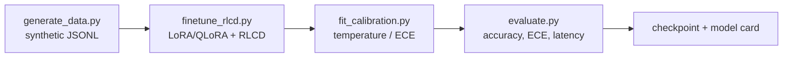

# Data & Training Strategy

**Status:** Implemented (M4) and executed full-scale on the RTX 3060 12GB (English + multilingual
LoRA, 6k train / 1.5k eval, temperature calibration; measured numbers in `benchmarks/report.md`).
**Related:** `docs/adr/ADR-0005-encoder-rlcd.md`, `.specs/features/training-calibration/spec.md`.

---

## Objective

Produce a local encoder backend that answers `noul` / `choice` / `score` in a single forward
pass, in 100+ languages, with **calibrated** probabilities — trainable and reproducible on a
single **RTX 3060 12GB**.

---

## Pipeline overview



Every stage is a committed script with a committed config and a fixed seed.

---

## 1. Data generation (`training/generate_data.py`)

**Goal:** deterministic, streamed synthetic supervision for the three primitives.

- **Determinism:** same seed + config → byte-identical output.
- **Streaming:** write JSONL incrementally; never hold the full dataset in memory.
- **Coverage:** per primitive, per language group, with hard negatives and boundary cases
  (near-ties, ambiguous labels, empty/very long inputs).
- **Localization (B-1):** the `state`, `instructions`, `criteria`, `score` levels, and
  `noul`/`score` entities are all authored per language, so the multilingual checkpoint does not
  learn an English template.
- **`noul` labels come from the text (B-11):** `target = 1` iff the emitted state was drawn from
  the `request` phrase bank, `0` for the `neutral` bank and for the empty boundary state (which
  reads as no request). The label never depends on the loop index, so no request-toned record can
  carry `0` — the old index-parity rule contradicted 50% of `eval_en.jsonl`'s request-toned rows
  and made `noul` accuracy label-bound (L-008). Only `noul.target` bytes move against the
  pre-B-11 datasets; states and questions are unchanged.
- **Domains (B-5):** every domain lives in its own committed file,
  `training/data/domains/<domain>.json`, holding its option labels, option terms and
  descriptions, entities, phrase banks, `score` levels, `noul` criteria and per-primitive
  instructions — one shape for every domain, per language. `--domains a,b,c` selects the domains
  to emit (default `support`, the original four-team triage); `DataConfig.domains` is the field.
  Two rules keep the existing datasets reproducible:
  - `support` keeps the **legacy record seed** (`seed:kind:index:language`), so its records are
    byte-identical whether generated alone or inside a five-domain run;
  - the `domain` field is written only for non-default runs, so `data.json`, `data_multi.json`
    and `data_noisy.json` regenerate byte-for-byte.
  `tests/test_training_generate.py` pins both rules with golden hashes and checks each committed
  data config against the dataset it documents.
- **Input-noise augmentation (B-4):** `--noise-rate r` (config field `noise_rate`) applies one
  deterministic surface edit — char swap/delete, accent strip, casing flip, or terminal-punctuation
  drop — to `r` of records' `state` only (labels/questions untouched). `r=0` reproduces the clean
  dataset byte-for-byte; each record draws from its own RNG (`(seed[, domain], kind, index,
  language, noise)`) so noise stays independent of the cyclic label (L-003). Evaluate the noisy
  view separately: the harness reports it under `report["noisy"]` when `--noise-rate` is passed.

### JSONL record format

```json
{"id": "noul-000001", "type": "noul", "state": "…", "instructions": "…", "criteria": {"true": "…", "false": "…"}, "target": 1, "lang": "en", "source": "synthetic"}
{"id": "choice-000001", "type": "choice", "state": "…", "instructions": "…", "criteria": {"a": null, "b": "…"}, "target": "b", "lang": "pt", "source": "synthetic"}
{"id": "score-000001", "type": "score", "state": "…", "instructions": "…", "criteria": ["poor","fair","good"], "target": 2, "lang": "es", "source": "synthetic", "domain": "voice"}
```

| Field | Meaning |
| --- | --- |
| `id` | Stable id, unique **within** a domain (a multi-domain run repeats ids across domains — pair it with `domain`) |
| `type` | `noul` / `choice` / `score` |
| `state` | The judged subject |
| `instructions` | The atomic question |
| `criteria` | Primitive-specific options/levels |
| `target` | Label (`0/1`, option key, or level index) |
| `lang` | Language tag for routing/stratification |
| `source` | Provenance (`synthetic`, `public`, `human`) |
| `domain` | Domain tag. Absent in single-domain `support` runs (byte-identity); present otherwise, and records without it evaluate as `support` |

### Data sources

- Synthetic generation (primary, deterministic).
- Public datasets for evaluation probes (MASSIVE, XNLI, typed-decisions) — **evaluation only**,
  never training, to keep benchmark claims honest.
- Optional human-curated seed sets for hard cases.

---

## 2. Fine-tuning (`training/finetune_rlcd.py`)

**Goal:** adapt ModernBERT-class (English) and mmBERT-base (multilingual) encoders with three
task heads, within 12GB VRAM.

### Architecture

- Shared encoder trunk.
- Three heads: `noul` (binary logit), `choice` (logits over options), `score` (logits over levels).
- Heads are trained jointly; the trunk is shared.

### Parameter-efficient training

| Technique | Why |
| --- | --- |
| LoRA (or QLoRA with 4-bit base) | Fits 12GB; small trainable footprint |
| Gradient checkpointing | Trades compute for memory |
| Gradient accumulation | Effective batch size without VRAM blowup |
| Mixed precision (bf16/fp16) | Speed + memory |
| Length-sorted batching | Fewer padding tokens |

### VRAM budget notes (RTX 3060 12GB)

- Full fine-tuning of large encoders is **not** feasible; LoRA/QLoRA is required.
- Two checkpoints are trained separately (English, multilingual), not simultaneously.
- If a config OOMs, reduce per-device batch first, then sequence length, then LoRA rank.
- Exact ceilings are measured and documented in M4-T6 (see B-002).

---

## 3. RLCD proper-scoring calibration (`training/finetune_rlcd.py`)

**Goal:** calibrated probabilities, not just correct labels.

- Train against a **strictly proper scoring rule** (e.g., log loss / Brier) over the primitive
  distributions. A proper scoring rule is minimized in expectation by reporting the true
  probability — this is what makes `confidence` meaningful.
- RLCD (reinforcement learning against the scoring rule) shapes the distribution beyond
  accuracy-only supervision.
- Probabilities are normalized before leaving the backend.

**Why proper scoring:** accuracy-only training produces overconfident, miscalibrated
distributions. Proper scoring directly optimizes the quantity users consume (`confidence`).

---

## 4. Calibration fitting (`training/fit_calibration.py`)

**Goal:** minimize ECE on a held-out calibration split.

- Fit a single temperature (or per-primitive temperatures) on a **calibration split**.
- **Per-(primitive, language) temperatures (B-1, implemented):** `fit_calibration.py` keeps the
  per-primitive fit and adds a per-language fit under `by_language`; the runtime selects
  `kind:lang` → `kind` → global, detecting the language from the state text. A language below
  `min_samples` warns and falls back to the per-primitive value.
- **Never** fit on the test split.
- Report ECE before/after; target is provisional (NFR-C06, `ECE ≤ 0.05` **[open]**).
- Persist the fitted temperature with the checkpoint.

---

## 5. Evaluation (`benchmarks/` + `training/evaluate.py`)

Report per primitive and per language group:

| Metric | Definition |
| --- | --- |
| Accuracy | Correct label rate |
| ECE | Expected calibration error over confidence bins |
| Latency | p50 / p95, batch=1 and batched |
| Throughput | requests/s vs batch size |
| Coverage | Languages/scripts exercised |

Public probes: **MASSIVE**, **XNLI**, **typed-decisions** — evaluation only and **not yet run**;
what is published today is the external nine-family `pngwn/system-one-decisions` head-to-head
(`docs/compare.md` §3, 2026-09-26). Committed reproduction commands cover the synthetic
evaluation only (see `docs/benchmarks.md` → Known limitations).

---

## 6. Reproducibility

- Every stage takes a config file (seed, hyperparameters, data paths) committed under
  `training/configs/`.
- Re-running with the same seed/config must land within documented tolerance.
- Artifacts record: git commit, hardware, library versions, seed, command.
- No secrets or private data in configs or artifacts.

---

## Limitations & risks

| Limitation | Impact | Mitigation |
| --- | --- | --- |
| RTX 3060 12GB | Bounds model size and batch | LoRA/QLoRA, checkpointing, accumulation |
| Synthetic data bias | Model inherits generator biases | Mix sources; human seed sets; eval on public probes |
| Small calibration sets | Noisy temperature fit | Stratify; warn on small N; hold out test |
| Multilingual imbalance | Weak languages | Stratify generation; per-language ECE reporting; per-language temperature (B-1) |
| Two checkpoints | Memory pressure | `max_loaded`, LRU eviction (ROUTE-04) |

---

## Open questions

- **OD-3:** weights distribution — RESOLVED by `docs/adr/ADR-0010` (HF Hub on demand + local cache;
  prefetch with `hf download` or a warm-up run, cache-only via `TACHYONE_OFFLINE=1`).
- Exact ECE target and binning scheme — resolved by the measured target (ECE ≤ 0.05,
  10 bins, `min_samples` 30) used in `benchmarks/report.md`.
- Whether the typed-decisions checkpoint is trained — deferred; tracked as `BACKLOG.md` B-7.